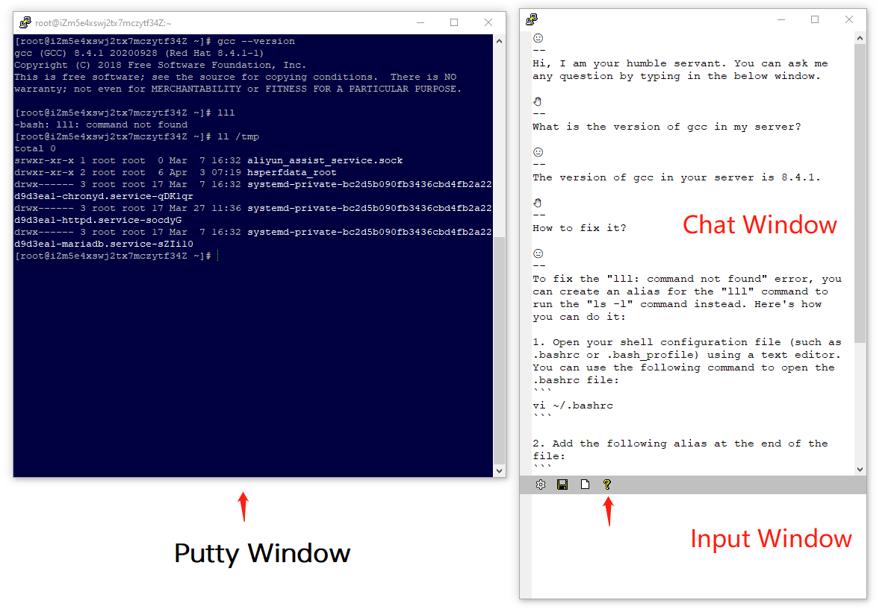
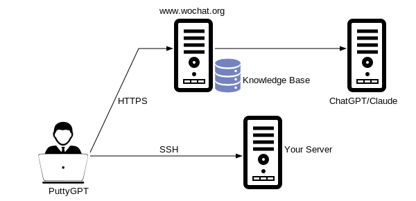

# PuttyGPT = Putty + ChatGPT

PuttyGPT is a dedicated AI chat robot for putty user. You can see the below screenshot to easily understand its usage.



You can PuttyGPT to connect to a server such as Linux or FreeBSD, just like what you do with Putty. But PuttyGPT has a robot chat window showing as well. During your operation, you can ask any question when you want. The AI chat robot will read the output of your Putty window and try to understand your problem, and provide professional answer to help you fix your trouble.

## How Does PuttyGPT Work?

The idea behind PuttyGPT is very simple, just like the picture showed in the below:

 

When you use PuttyGPT to connect to your server such as Linux/FreeBSD box, a robot chat window will also be created. This robot chat window will connect to www.wochat.org by using HTTPS protocal. When you have trouble during your operation with your server, you want to seek help. You can ask the questions in the robot chat window. PuttyGPT will send the below information to www.wochat.org:
1. your question.
2. the output of your Putty window.

So, if you care about the sensitivity of the output of your PuttyGPT window, **STOP!** Do not use PuttyGPT!

But, if you are a student to learn some IT technology such as Linux operation, PostgreSQL/MySQL adminstration etc, you may not care about the sensitivity of the output of your lab server. What you want to do is to get some professional suggestion or help somewhere, then PuttyGPT is a very very good assistant during your study journey.

After your question and the output of your Putty window are sent to www.wochat.org, we have a professional knowledge base focus on Linux/PostgreSQL/MySQL, etc. www.wochat.org will search the knowledge in the knowlege base and send your question to some famous general LLM(large language model) such as ChatGPT or Claude.  So the information sent to ChatGPT/Claude include:

1. your question.
2. the output of your Putty window.
3. the knowledge found in the knowledge base.
4. more professional prompts generated by a special LLM on www.wochat.org.

When ChatGPT or Claude gets the above information, it will generate more professional answer, especially dedicated to your question and trouble. This is the key value of PuttyGPT. It's answer is more professional than the answer of the general LLM such as ChatGPT or Claude. So please try PuttyGPT, and compare the answer of PuttyGPT with the answer you ask ChatGPT directly. You will find the difference. And we hope PuttyGPT will help you better than ChatGPT on the focus area such Linux/PostgreSQL/MySQL adminstration.

PuttyGTP is always open-sourced and free.

## How To Use PuttyGPT?

If you are familar with Putty, then you have little issue to learn how to use PuttyGPT. It is just another Putty, but with AI chating ablility.

When it is the first time for PuttyGPT to run, it will check if there is a configuration file called conf.json in the same directory. If it cannot find this file, putty.exe will generate a conf.json file filled with the default parameters, as showed in the below:

```
c:\gpt\PuttyGPT\release>type conf.json
{
"key" : "03339A1C8FDB6AFF46845E49D120E0400021E161B6341858585C2E25CA3D9C01CA",
"url" : "https://www.wochat.org/v1",
"font0" : "Courier New",
"font1" : "Courier New",
"fsize0" : 11,
"fsize1" : 11,
"startchat" : 1,
"autologging" : 1,
"proxy_type" : 0,
"proxy" : ""
}
```

In the above parameter steetings, the most important thing is the "key". wochat.org will use this key value to identify the user. The default key is a free-for-ever key you can try. Or you can go to https://www.wochat.org to register a new account and generate a new key to get more professional service.

Let us explain the meaning of parameters:
- key : a 66-byte long string only contains 0-9 and A-Z. The backend server will use this key to idenify the authorized user.
- url : this is the interface where PuttyGPT will send the request to. Usually you know not need to change it.
- font0 : the font name of the chat window. This is the upper window in the robot chat window.
- font1 : the font name of the input window. This is the lower window in the robot chat window where you can input your question.
- fsize0 : the font size for font0. 11 is a good default value. But you can enlarge it to 13 or 36 to try to get the best size you like.
- fsize1 : the font size for font1.
- startchat : if this parameter is 0, the robot chat window will not pop up when you start PuttyGPT. None-zero value means the robot chat window will pop out when you connect to your server. 
- autologging: if this parameter is 0, PuttyGPT will not save all the chat history into the log files like log_xxxx.txt. None-zero value will record all the chat history.

If you connect to the internet by using some proxy, you need to configure the below parameters:
- proxy_type : The value is from 0 to 8. Zero means no proxy. This is the common case. 
- proxy : if proxy_type is non-zero, we will use these parameters to configure your proxy settings. 

For better understanding for proxy settings, please check the below link as a good start point:

https://curl.se/libcurl/c/CURLOPT_PROXYTYPE.html

