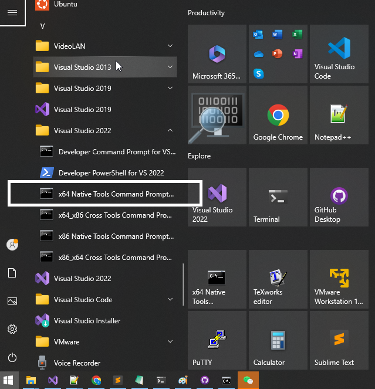
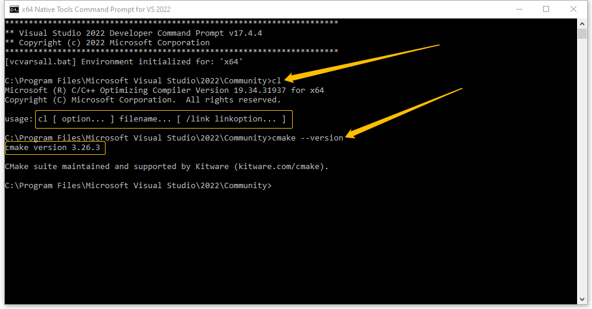

# The Guide About Building PuttyGPT From Source Code 

This document describes the step by step details about how to build PuttyGPT from the source code.

The source code of PuttyGPT is based on the source code of Putty 0.8. As we know, Putty is a very famous SSH tool and it has great reputation in security area. What we did is only adding less than 2000 lines of source code into the codebase of Putty. The new source code does not change anything of Putty kernel. It only handles the AI chat window that is to communicate with the server of wochat.org by using HTTPS protocol. 

If you trust the codebase of Putty, and if you are clear about the logic of the new source code added by PuttyGPT, then you will be confident about the security quality of PuttyGPT. This document will help you establish your confidence about PuttyGPT and enjoy what PuttyGPT did for you.

The completed PuttyGPT program is only one execution file called "puttygpt.exe". You do not need anything else. In order to generate puttygpt.exe, You have two options:
- If you trust the source code of PuttyGPT, we will compile the source code of PuttyGPT directly to generate puttygpt.exe.
- If you do NOT trust the source code of PuttyGPT, but you trust the source code of Putty, well, we will let you know how to compile puttygpt.exe from the source code of Putty. 

This document has three sections:
- Prepare the building environment.
- Build the source code of PuttyGPT directly
- Build puttygpt.exe from the source code of Putty.

## PrePare the Building Environment

PuttyGPT currently can only run on Windows platform. We will build PuttyGPT in X64 mode only. We need to install four software tools before our building process:
- Visual Studio 2022(Community Version) - the top 1 C/C++ compiler, linker and IDE for software development mainly focus on Windows platform.
- CMake - a cross-platform free and open-source software for build automation, testing, packaging and installation of software.
- GIT - a distributed version control system that tracks changes in any set of computer files, usually used for coordinating work among programmers who are collaboratively developing source code during software development.
- VCPkg - a cross-platform open source package manager by Microsoft.

All these four tools are free. There are tons of documents describing how to install VSTS(Visual Studio) 2022, CMake and GIT in the internet. So we will skip the installation of these tools. We will explain the details of VCPkg installation later.

After your installation of VSTS 2022 is done. You can find a shortcut in the main menu of Windows 10/11: “x64 Native Tools Command Prompt for VSTS 2022”. 



Click it and the system will open a command line window that shows the below text:



You can type some common build commands such as cl, nmake, cmake --version to verify all these tools are workable. You can see from the above window that the version of cmake is 3.26.3.

If your output is similar to the above output, that is great! Your build tools are ready. We will run all commands in this window during our later buidling steps. Please remember this!  We also assume that all files will be saved to c:\gpt. 

As a common sense in C programming world, we know that if our C program needs to use some functionalities of a library, we need two things: the head file(s)(xxxx.h) and the library file(xxxx.lib on windows and xxxx.a on Linux). After we get these two things of a library, we can link the library into our C program. 

puttyGPT relies on the below libraries:
- libcurl
- cJSON
- Scintilla

The library libcurl is a very popular network library used to send the data to www.wochat.org by using HTTPS. 
The library cJSON is used to parse the configuration file conf.json which is in the same directory of puttygpt.exe. 
Scintilla is a very famous library to create a professional text editor window. We use this library to create the chat window. 

To build libCurl is a hard work because it also needs other libraries such as zlib and security libraries such as openssl. Luckily we can use vcpkg to make life much easier. 

### Install VCPkg

The installation of VCPkg is supper easy. Run the below command in c:\gpt:

```
git clone https://github.com/microsoft/vcpkg.git
```

Git will download the necessary files and save to c:\gpt\vckpg. In c:\gpt\vcpkg, run the below commands:
```
bootstrap-vcpkg.bat
```
This batch file will download the last version of vcpkg.exe and save it into the same folder. vcpkg.exe is the main program we used to search and install libraries.

### Build libCurl and cJSON

Now we can search and install libcurl and cJSON by using vcpkg.exe. Run the below commands in c:\gpt\vcpkg:
```
C:\gpt\vcpkg>vcpkg.exe search cJSON
...
cjson                    1.7.17           Ultralightweight JSON parser in ANSI C
cjson[utils]                              Enable building the cJSON_Utils library
staticjson               1.0.0            Fast, direct and static typed parsing of JSON with C++
...

C:\gpt\vcpkg>vcpkg.exe search curl
...

curl[openssl]                             SSL support (OpenSSL)
curl[schannel]                            SSL support (Secure Channel)
curl[sectransp]                           SSL support (sectransp)
curl[ssh]                                 SSH support via libssh2
curl[ssl]                                 Default SSL backend

...

```

We will install static libraries for cJSON and libcurl. So run the below commands in c:\gpt\vcpkg. 
```
vcpkg install cjson:x64-windows-static
vcpkg install curl[schannel]:x64-windows-static 
```

After a while, we can find a folder called "packages" in c:\gpt\vcpkg. Check the files in this folder:
```
C:\gpt\vcpkg\packages>dir
 
04/06/2024  07:56 PM    <DIR>          .
04/06/2024  07:56 PM    <DIR>          ..
04/06/2024  07:55 PM    <DIR>          cjson_x64-windows-static
04/06/2024  07:56 PM    <DIR>          curl_x64-windows-static
04/06/2024  07:55 PM    <DIR>          detect_compiler_x64-windows
04/06/2024  07:56 PM    <DIR>          detect_compiler_x64-windows-static
04/06/2024  07:55 PM    <DIR>          vcpkg-cmake-config_x64-windows
04/06/2024  07:55 PM    <DIR>          vcpkg-cmake_x64-windows
04/06/2024  07:56 PM    <DIR>          zlib_x64-windows-static
               0 File(s)              0 bytes
               9 Dir(s)  278,982,643,712 bytes free
```

We can see 3 folders: 
- cjson_x64-windows-static
- curl_x64-windows-static 
- zlib_x64-windows-static. 

Our xxxx.lib and xxxx.h files are in these folders. You can check them by yourself. For example, let us check the folder curl_x64-windows-static:
```
C:\gpt\vcpkg\packages\curl_x64-windows-static>dir
 
04/06/2024  07:56 PM    <DIR>          .
04/06/2024  07:56 PM    <DIR>          ..
04/06/2024  07:56 PM                44 BUILD_INFO
04/06/2024  07:56 PM               814 CONTROL
04/06/2024  07:56 PM    <DIR>          debug
04/06/2024  07:56 PM    <DIR>          include
04/06/2024  07:56 PM    <DIR>          lib
04/06/2024  07:56 PM    <DIR>          share
04/06/2024  07:56 PM    <DIR>          tools
               2 File(s)            858 bytes
               7 Dir(s)  278,981,922,816 bytes free

C:\gpt\vcpkg\packages\curl_x64-windows-static>dir lib
 
04/06/2024  07:56 PM    <DIR>          .
04/06/2024  07:56 PM    <DIR>          ..
04/06/2024  07:56 PM        14,648,824 libcurl.lib
04/06/2024  07:56 PM    <DIR>          pkgconfig
               1 File(s)     14,648,824 bytes
               3 Dir(s)  278,981,922,816 bytes free
```

We can see the libcurl.lib file that we need to link to our PuttyGPT program. You need to remember the location of the header files which is "include" folder. There is also a lib file in "debug" folder that is used to link when you compile your program in "Debug" mode.

### Build Scintilla

Download Scintilla from https://www.scintilla.org/scintilla543.zip

Unzip the source code of scintilla to c:\gpt\scintilla. In "x64 Native Tools Command Prompt for VSTS 2022" window, run the below command in c:\gpt\scintilla folder:

```
cd win32
nmake -f scintilla.mak
```

You can find libscintilla.lib in C:gpt\scintilla\bin folder. This is the static link library we will use in PuttyGPT. And of course we need several head files in C:\gpt\scintilla\include.

```
C:\gpt\scintilla\bin>dir *.lib
 04/06/2024  07:40 PM        31,050,712 libscintilla.lib
04/06/2024  07:40 PM             1,806 Scintilla.lib
               2 File(s)     31,052,518 bytes
               0 Dir(s)  273,037,524,992 bytes free

C:\gpt\scintilla\include>dir
...

03/09/2024  03:15 AM            48,310 Scintilla.h
03/09/2024  03:15 AM               851 Sci_Position.h
...
```

Now we have libscintilla.lib and Scintilla.h. Remeber their location.

So far we have completed the build environment preparation. You are great!

## Build the Source Code of PuttyGPT

Download the source code of PuttyGPT by runing the below command in c:\gpt
```
git clone https://github.com/wochatme/puttyGPT.git
```

Git will create a folder called "puttyGPT" in c:\gpt. Use any text editor you like to edit c:\gpt\puttyGPT\windows\CMakeLists.txt. Search "add_executable(putty", and it should in line 99 or nearby. You can see the below texts:
```
add_executable(puttygpt
  window.c
  putty.c
  help.c
  putty.rc)

target_include_directories(puttygpt PUBLIC c:/gpt/vcpkg/packages/curl_x64-windows-static/include)
target_include_directories(puttygpt PUBLIC c:/gpt/vcpkg/packages/cjson_x64-windows-static/include)
target_include_directories(puttygpt PUBLIC c:/gpt/scintilla/include)

target_link_libraries(puttygpt debug c:/build/askrob/scintilla/Debug/scintilla.lib)
target_link_libraries(puttygpt optimized c:/build/askrob/scintilla/MinSizeRel/scintilla.lib)

target_link_libraries(puttygpt debug c:/gpt/vcpkg/packages/curl_x64-windows-static/debug/lib/libcurl-d.lib)
target_link_libraries(puttygpt debug c:/gpt/vcpkg/packages/zlib_x64-windows-static/debug/lib/zlibd.lib)
target_link_libraries(puttygpt debug c:/gpt/vcpkg/packages/cjson_x64-windows-static/debug/lib/cjson.lib)
# target_link_libraries(puttygpt debug c:/gpt/scintilla/bin/libscintilla.lib)

target_link_libraries(puttygpt optimized c:/gpt/vcpkg/packages/curl_x64-windows-static/lib/libcurl.lib)
target_link_libraries(puttygpt optimized c:/gpt/vcpkg/packages/zlib_x64-windows-static/lib/zlib.lib)
target_link_libraries(puttygpt optimized c:/gpt/vcpkg/packages/cjson_x64-windows-static/lib/cjson.lib)
# target_link_libraries(puttygpt optimized c:/gpt/scintilla/bin/libscintilla.lib)


be_list(puttygpt PuTTY SSH SERIAL OTHERBACKENDS)
add_dependencies(puttygpt generated_licence_h)
target_link_libraries(puttygpt
  guiterminal guimisc eventloop sshclient otherbackends settings network crypto
  utils
  ${platform_libraries})
set_target_properties(puttygpt PROPERTIES
  WIN32_EXECUTABLE ON
  LINK_FLAGS "${LFLAG_MANIFEST_NO}")
installed_program(puttygpt)
```

You need to change the path in target_include_directories and target_link_libraries instructions according to your environment.


In "x64 Native Tools Command Prompt for VSTS 2022" window, run the below commands:
```
cd c:\gpt\puttyGPT
cmake -S . -B release -G "NMake Makefiles" -DCMAKE_BUILD_TYPE=MinSizeRel
cd release
nmake
```

## Get the Source Code of Putty

You can download the source code of Putty from here:

https://www.chiark.greenend.org.uk/~sgtatham/putty/latest.html

We use the file putty-src.zip as the codebase of Putty. Its download link is:

https://the.earth.li/~sgtatham/putty/latest/putty-src.zip

In order to verify the source code is from the original author, you can refer this page about how to verify the signature of the source code:

https://www.chiark.greenend.org.uk/~sgtatham/putty/keys.html

The below content assumes that we trust the source code of putty-src.zip. Unzip this file into a folder. We will put all files for the whole building procedure in c:\gpt. Let us say the source code of Putty is unzipped into c:\gpt\putty. The initial file layout is like the below:

```
C:\gpt>dir

04/06/2024  06:56 PM    <DIR>          .
04/06/2024  06:56 PM    <DIR>          ..
04/06/2024  06:56 PM    <DIR>          putty
               0 File(s)              0 bytes
               3 Dir(s)  273,311,477,760 bytes free
```


## Install Build Tools

We need to use the Visual Studio 2022(community version) and CMake to build the source code of Putty. Because VSTS(Visual Studio) 2022 and CMake are both free. You can easily install them. There are tons of documents to describe how to install these two software, so we do not describe the steps to install these two tools.


## Build Putty Source Code

In the "x64 Native Tools Command Prompt for VSTS 2022" window, go to c:\gpt\putty, and run the below command
```
cmake -S . -B build_debug -G "NMake Makefiles" -DCMAKE_BUILD_TYPE=Debug
```
The about command will create a new folder called "build_debug" in c:\gpt\putty. Then we go to this folder in the same window, and run the below commands
```
cd build_debug
nmake
```
After a while, you can see the build is complete, and you can see many .exe files in c:\gpt\putty\build_debug. What we are interested is the putty.exe
```
C:\gpt\putty\build_debug>dir putty.exe
 
04/06/2024  07:22 PM         2,245,632 putty.exe
               1 File(s)      2,245,632 bytes
               0 Dir(s)  273,112,059,904 bytes free
```
You can run the putty.exe by typing putty.exe in the same window or double click this file in file explorer. 

Maybe you want to build a release version which has a smaller image size. Putty disable us to compile release verion from the source code. So remove the below texts from c:\gpt\putty\defs.h. These texts are located between line 14 to line 23 in defs.h. 
```
#ifdef NDEBUG
/*
 * PuTTY is a security project, so assertions are important - if an
 * assumption is violated, proceeding anyway may have far worse
 * consequences than simple program termination. This check and #error
 * should arrange that we don't ever accidentally compile assertions
 * out.
 */
#error Do not compile this code base with NDEBUG defined!
#endif
```

Then we run the below commands in c:\gpt\putty folder:
```
cmake -S . -B build_release -G "NMake Makefiles" -DCMAKE_BUILD_TYPE=MinSizeRel
cd build_release
nmake
```

You can see the size difference of putty.exe in Debug and MinSizeRel mode:
```
C:\gpt\putty>dir build_debug\putty.exe
 
04/06/2024  07:22 PM         2,245,632 putty.exe
               1 File(s)      2,245,632 bytes
               0 Dir(s)  273,128,603,648 bytes free

C:\gpt\putty>dir build_release\putty.exe
 
04/06/2024  07:31 PM           826,880 putty.exe
               1 File(s)        826,880 bytes
               0 Dir(s)  273,128,599,552 bytes free
```

As we can see that putt.exe i MinSizeRel mode is only 800KB, compared with the 2MB in Debug mode. 

If you complete all the above steps successfully and get the binary file putty.exe. That is awesome! We know how to build the source code of Putty, and we trust the putty.exe compiled from the original source code of Putty. So the next step is how to add the new source code of puttyGPT into the codebase of Putty and build puttygpt.exe. Let's go!


## Build PuttyGPT

Now we have all necessary libraries ready, we can build PuttyGPT. The first thing is to download the repository of PuttyGPT into your local disk.
```
git clone https://github.com/wochatme/puttyGPT.git
```

Now our disk layout looks like the below:
```
C:\gpt>dir
 
04/06/2024  10:16 PM    <DIR>          .
04/06/2024  10:16 PM    <DIR>          ..
04/06/2024  07:25 PM    <DIR>          putty
04/06/2024  10:16 PM    <DIR>          puttyGPT
04/06/2024  07:38 PM    <DIR>          scintilla
04/06/2024  07:55 PM    <DIR>          vcpkg
               0 File(s)              0 bytes
               6 Dir(s)  278,965,551,104 bytes free
```

The folder "putty" has the orginal source code of Putty that we trust. The folder "puttyGPT" has the new source code we need to merge into the codebase of Putty. Let me show you how to do the merge.

The first thing we need to be clear is what PuttyGPT added and what PuttyGPT changed.

What we added into the codebase of Putty are two header files: askrob.h and askrob_terminial.h. The two files contain all the logic of robot chat window.
```
C:\gpt\puttyGPT\windows\askrob>dir
 
04/08/2024  07:13 AM    <DIR>          .
04/08/2024  07:13 AM    <DIR>          ..
04/08/2024  07:13 AM            51,511 askrob.h
04/08/2024  07:13 AM             7,084 askrob_terminial.h
               2 File(s)         58,595 bytes
               2 Dir(s)  280,589,889,536 bytes free
```

And PuttyGPT also add 4 bitmap files as the buttons showing in the robot chat window:
```
C:\gpt\puttyGPT\windows>dir *.bmp
 
04/08/2024  07:13 AM               774 emptylog.bmp
04/08/2024  07:13 AM               774 question.bmp
04/08/2024  07:13 AM               774 savefile.bmp
04/08/2024  07:13 AM               774 settings.bmp
               4 File(s)          3,096 bytes
               0 Dir(s)  280,582,492,160 bytes free
```

What we changed in the codebase of Putty are the below files:

```
C:\gpt\putty\windows\window.c
C:\gpt\putty\windows\putty-rc.h
C:\gpt\putty\windows\putty.rc
C:\gpt\putty\terminal\terminal.c
```

You can use some compare tool such as "diff" on Linux to compare the above 4 files with the files in PuttyGPT to know what has been changed.

After we are clear about what PuttyGPT added and modified, merge these changes into the codebase of Putty is pretty simple. Let me explain it in details.

### Merge UI Resource

Run the below commands to copy the bitmap resources to putty folder:
```
C:\gpt\putty\windows>copy c:\gpt\puttyGPT\windows\*.bmp .
c:\gpt\puttyGPT\windows\emptylog.bmp
c:\gpt\puttyGPT\windows\question.bmp
c:\gpt\puttyGPT\windows\savefile.bmp
c:\gpt\puttyGPT\windows\settings.bmp
        4 file(s) copied.
```

Edit the putty.rc file in c:\gpt\putty\windows folder, and add the below texts in it, at around line 10:
```
IDB_QUESTION     BITMAP     "question.bmp"
IDB_SAVEFILE     BITMAP     "savefile.bmp"
IDB_EMPTYLOG     BITMAP     "emptylog.bmp"
IDB_SETTINGS     BITMAP     "settings.bmp"
```

Edit putty-rc.h file in c:\gpt\putty\windows folder, and add the below texts in it, at around line 11:
```
/* AskRob */
#define IDB_QUESTION     300
#define IDB_SAVEFILE     301
#define IDB_EMPTYLOG     302
#define IDB_SETTINGS     303
```

After the above modification, in c:\gpt\putty\build-debug, run nmake command to compile the whole codebase of putty to be sure there is no error after each modification. We can use this trick to check that everything looks good after a small modification.

### Merge Source Code

In c:\gpt\puttyGPT\windows, there is one folder called "raskrob", please copy the whole folder into c:\gpt\putty\windows
```
C:\gpt\putty\windows>mkdir askrob

C:\gpt\putty\windows>cd askrob

C:\gpt\putty\windows\askrob>copy c:\gpt\puttyGPT\windows\askrob\* .
c:\gpt\puttyGPT\windows\askrob\askrob.h
c:\gpt\puttyGPT\windows\askrob\askrob_terminial.h
        2 file(s) copied.
```

Then you can copy the below files into the codebase of Putty to overwrite the original files:
```
C:\gpt\puttyGPT\windows\window.c
C:\gpt\puttyGPT\windows\putty-rc.h
C:\gpt\puttyGPT\windows\putty.rc
C:\gpt\puttyGPT\terminal\terminal.c
```

If you want to review what has been changed, please use "diff" or similar command to compare the files.


### Edit CMakeList.txt

Edit the CMakeList.txt in c:\gpt\putty\windows, and add the below lines at around line 105:
```
add_executable(putty
  window.c
  putty.c
  help.c
  putty.rc)
################################## The below is we added #####################################
target_include_directories(putty PUBLIC c:/gpt/vcpkg/packages/curl_x64-windows-static/include)
target_include_directories(putty PUBLIC c:/gpt/vcpkg/packages/cjson_x64-windows-static/include)
target_include_directories(putty PUBLIC c:/gpt/scintilla/include)

target_link_libraries(putty debug c:/gpt/vcpkg/packages/curl_x64-windows-static/debug/lib/libcurl-d.lib)
target_link_libraries(putty debug c:/gpt/vcpkg/packages/zlib_x64-windows-static/debug/lib/zlibd.lib)
target_link_libraries(putty debug c:/gpt/vcpkg/packages/cjson_x64-windows-static/debug/lib/cjson.lib)
target_link_libraries(putty debug c:/gpt/scintilla/bin/libscintilla.lib)

target_link_libraries(putty optimized c:/gpt/vcpkg/packages/curl_x64-windows-static/lib/libcurl.lib)
target_link_libraries(putty optimized c:/gpt/vcpkg/packages/zlib_x64-windows-static/lib/zlib.lib)
target_link_libraries(putty optimized c:/gpt/vcpkg/packages/cjson_x64-windows-static/lib/cjson.lib)
target_link_libraries(putty optimized c:/gpt/scintilla/bin/libscintilla.lib)
################################## The above is we added #####################################  
be_list(putty PuTTY SSH SERIAL OTHERBACKENDS)

```
You can modify the path according to your environment.

And please comment out the below content or remove them.
```
# add_executable(puttytel
#   window.c
#   putty.c
#   help.c
#   ${CMAKE_SOURCE_DIR}/stubs/no-gss.c
#   ${CMAKE_SOURCE_DIR}/stubs/no-ca-config.c
#   ${CMAKE_SOURCE_DIR}/stubs/no-rand.c
#   ${CMAKE_SOURCE_DIR}/proxy/nocproxy.c
#   ${CMAKE_SOURCE_DIR}/proxy/nosshproxy.c
#   puttytel.rc)

# be_list(puttytel PuTTYtel SERIAL OTHERBACKENDS)
# add_dependencies(puttytel generated_licence_h)
# target_link_libraries(puttytel
#   guiterminal guimisc eventloop otherbackends settings network utils
#   ${platform_libraries})
# set_target_properties(puttytel PROPERTIES
#   WIN32_EXECUTABLE ON
#   LINK_FLAGS "${LFLAG_MANIFEST_NO}")
# installed_program(puttytel)
```

And please remove the below content. We only want to build putty.exe, we are not interested in the puttytel.exe and pterm.exe build.
```
if(HAVE_CONPTY)
  add_executable(pterm
    window.c
    pterm.c
    help.c
    conpty.c
    ${CMAKE_SOURCE_DIR}/stubs/no-gss.c
    ${CMAKE_SOURCE_DIR}/stubs/no-ca-config.c
    ${CMAKE_SOURCE_DIR}/stubs/no-rand.c
    ${CMAKE_SOURCE_DIR}/proxy/nosshproxy.c
    pterm.rc)
  be_list(pterm pterm)
  add_dependencies(pterm generated_licence_h)
  target_link_libraries(pterm
    guiterminal guimisc eventloop settings network utils
    ${platform_libraries})
  set_target_properties(pterm PROPERTIES
    WIN32_EXECUTABLE ON
    LINK_FLAGS "${LFLAG_MANIFEST_NO}")
  installed_program(pterm)
 else()
  message("ConPTY not available; cannot build Windows pterm")
 endif()
 ```

### Build It!

We have complated all modifications and now it is ready to build. Run the below commands in c:\gpt\putty:
```
cmake -S . -B puttygpt -G "NMake Makefiles" -DCMAKE_BUILD_TYPE=MinSizeRel
cd puttygpt
nmake
```

After a while, we can see the putty.exe in c:\gpt\putty\puttygpt:
```
C:\gpt\putty\puttygpt>dir putty.exe
 
04/06/2024  11:17 PM         2,198,016 putty.exe
               1 File(s)      2,198,016 bytes
               0 Dir(s)  278,985,723,904 bytes free
```

What you need to do is to rename this file to puttygtp.exe:
```
C:\gpt\putty\puttygpt>rename putty.exe puttygpt.exe
C:\gpt\putty\puttygpt>puttygpt.exe                      <-- RUN IT!!!!!!
```

When it is the first time for PuttyGPT to run, it will check if there is a configuration file called conf.json in the same directory. If it cannot find this file, putty.exe will generate a conf.json file filled with the default parameters, as showed in the below:

```
C:\gpt\putty\puttygpt>type conf.json
{
"key" : "03339A1C8FDB6AFF46845E49D120E0400021E161B6341858585C2E25CA3D9C01CA",
"url" : "https://www.wochat.org/v1",
"font0" : "Courier New",
"font1" : "Courier New",
"fsize0" : 11,
"fsize1" : 11,
"startchat" : 1,
"autologging" : 1,
"proxy" : 0,
"user" : "x",
"password" : "x",
"domain" : "x",
"host" : "localhost",
"port" : 443
}
```

In the above parameter steetings, the most important thing is the "key". wochat.org will use this key value to identify the user. The default key is a free-for-ever key you can try. Or you can go to https://www.wochat.org to register a new account and generate a new key to get more professional service.

Let me explain the meanings of other parameters:
- url : this is the interface where PuttyGPT will send the request to. Usually you know not need to change it.
- font0 : the font name of the chat window. This is the upper window in the robot chat window.
- font1 : the font name of the input window. This is the lower window in the robot chat window where you can input your question.
- fsize0 : the font size for font0. 11 is a good default value. But you can enlarge it to 13 or 36 to try to get the best size you like.
- fsize1 : the font size for font1.
- startchat : if this parameter is 0, the robot chat window will not pop up when you start PuttyGPT. None-zero value means the robot chat window will pop out when you connect to your server. 
- autologging: if this parameter is 0, PuttyGPT will not save all the chat history into the log files like log_xxxx.txt. None-zero value will record all the chat history.
- proxy : If you connect to the internet by using some proxy, you need to set the value to some none-zero value. Zero means no proxy. This is the common case. We will provde more explaination for this parameter in the future.
- user/password/domain/host/port : if proxy is non-zero, we will use these parameters to configure your proxy settings. We will provde more explaination for this parameter in the future.

For better understanding for proxy settings, please check the below link as a good start point:

https://curl.se/libcurl/c/CURLOPT_PROXYTYPE.html

After you change the values of conf.json, you need to restart PuttyGPT to make these changes effective.

## Question?

Any question or suggestion, please shoot email to wochatdb@gmail.com

Enjoy coding!
